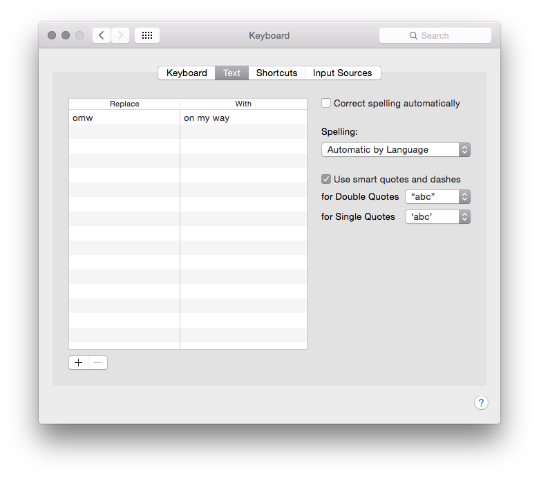

# osx-shortcut 

> Add autocorrect text shortcuts, as in, when I type `$a`, its
> expanded to `$b`.

Tested on OS X 10.10 (Yosemite), might work earlier.

Uses undocumented features, meaning that this might break on new releases
of OS X (but your shortcuts will not).

## Install

[npm](https://docs.npmjs.com/cli/install):

```bash
npm install osx-shortcut --global
```

## Usage

```text
Usage: shortcut [options] <replace> <with>

Options:

  -h, --help     output usage information
  -v, --version  output version

Examples:

  $ shortcut "omw" "on my way"

See also: man 1 shortcut
```

Go to `System Preferences` > `Keyboard` > `Text` to see your shortcuts.



## License

[MIT](LICENSE) © [Titus Wormer](http://wooorm.com)
